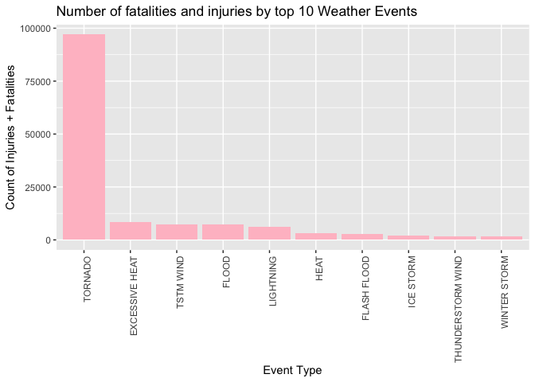
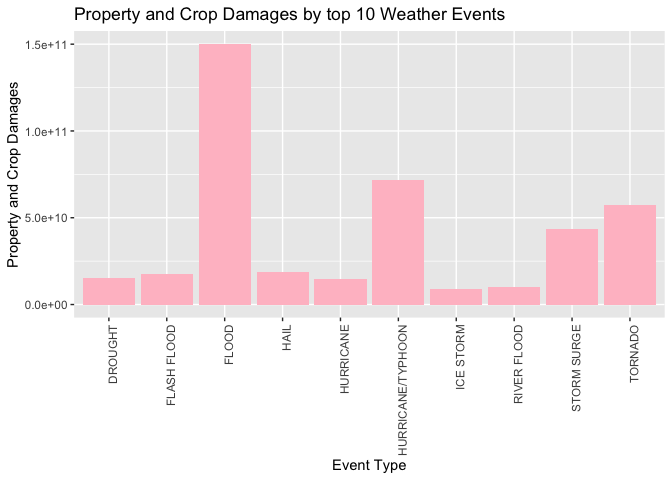

Exploring the NOAA Storm Database : Health and Economic impacts of
Severe Weather in the US.
================

### Assignment

The basic goal of this assignment is to explore the NOAA Storm Database
and answer some basic questions about severe weather events. You must
use the database to answer the questions below and show the code for
your entire analysis. Your analysis can consist of tables, figures, or
other summaries. You may use any R package you want to support your
analysis.

### Synopsis

Storms and other severe weather events can cause both public health and
economic problems for communities and municipalities.

This project involves exploring the U.S. National Oceanic and
Atmospheric Administration’s (NOAA) storm database. This database tracks
characteristics of major storms and weather events in the United States,
including when and where they occur, as well as estimates of any
fatalities, injuries, and property damage.

### The data analysis must address the following questions :

Across the United States, which types of events (as indicated in the
EVTYPE variable) are most harmful with respect to population health ?
Across the United States, which types of events have the greatest
economic consequences ?

### This analysis shows by aggregating the data by storm events type :

  - Tornados are the most harmfull events on population health
    (including injury and fatalities).
  - Floods are responsible for the most economic damage.

## Data Processing

``` r
library(data.table)
library(R.utils)
library(ggplot2)
library(dplyr)
```

``` r
# Checking if file exists and if not then downloading
if(!file.exists("stormData.csv.bz2")) {
  download.file("https://d396qusza40orc.cloudfront.net/repdata%2Fdata%2FStormData.csv.bz2",
  destfile = "stormData.csv.bz2", method = "curl")
}

# using fread to create dataframe
raw_data <- fread("stormData.csv.bz2", sep = ",", header = TRUE)
```

``` r
#Sebsetting NOAA database to required fields
df_noaa <-  raw_data[,c('EVTYPE','FATALITIES','INJURIES', 'PROPDMG', 'PROPDMGEXP', 'CROPDMG', 'CROPDMGEXP')]
```

Convert H, K, M, B units to calculate Property Damage as per discussion
in forums
[here\!](https://www.coursera.org/learn/reproducible-research/discussions/weeks/4/threads/38y35MMiEeiERhLphT2-QA)

``` r
df_noaa$PROPDMGNUM = 0
df_noaa[df_noaa$PROPDMGEXP == "H", ]$PROPDMGNUM = df_noaa[df_noaa$PROPDMGEXP == "H", ]$PROPDMG * 10^2
df_noaa[df_noaa$PROPDMGEXP == "K", ]$PROPDMGNUM = df_noaa[df_noaa$PROPDMGEXP == "K", ]$PROPDMG * 10^3
df_noaa[df_noaa$PROPDMGEXP == "M", ]$PROPDMGNUM = df_noaa[df_noaa$PROPDMGEXP == "M", ]$PROPDMG * 10^6
df_noaa[df_noaa$PROPDMGEXP == "B", ]$PROPDMGNUM = df_noaa[df_noaa$PROPDMGEXP == "B", ]$PROPDMG * 10^9
```

Convert H, K, M, B units to calculate Crop Damage as per the discussion
in forums
[here\!](https://www.coursera.org/learn/reproducible-research/discussions/weeks/4/threads/38y35MMiEeiERhLphT2-QA)

``` r
df_noaa$CROPDMGNUM = 0
df_noaa[df_noaa$CROPDMGEXP == "H", ]$CROPDMGNUM = df_noaa[df_noaa$CROPDMGEXP == "H", ]$CROPDMG * 10^2
df_noaa[df_noaa$CROPDMGEXP == "K", ]$CROPDMGNUM = df_noaa[df_noaa$CROPDMGEXP == "K", ]$CROPDMG * 10^3
df_noaa[df_noaa$CROPDMGEXP == "M", ]$CROPDMGNUM = df_noaa[df_noaa$CROPDMGEXP == "M", ]$CROPDMG * 10^6
df_noaa[df_noaa$CROPDMGEXP == "B", ]$CROPDMGNUM = df_noaa[df_noaa$CROPDMGEXP == "B", ]$CROPDMG * 10^9
```

## Results

### Question 1 : Across the United States, which types of events (as indicated in the EVTYPE variable) are most harmful with respect to population health?

I am going to consider both Injuries and Fatalities as Harmful hence we
will calculate the sum of both columns

``` r
# harmful events aggregation summing fatalities + injuries
harmful_events <- aggregate(FATALITIES+INJURIES ~ EVTYPE, data = df_noaa, sum)

#ordering the dataset for top 10 events
harmful_events_top10 <- harmful_events[order(-harmful_events$FATALITIES),][1:10,]
harmful_events_top10 <- harmful_events_top10 %>%
     rename(FI = `FATALITIES + INJURIES`)
harmful_events_top10$EVTYPE <- factor(harmful_events_top10$EVTYPE, levels = harmful_events_top10$EVTYPE)


#Creating the plot to see the top 10 

ggplot(data = harmful_events_top10, aes(x= EVTYPE, y= FI)) +
     geom_bar(fill = "pink", stat="identity") +
     theme(axis.text.x = element_text(angle = 90, hjust = 1)) +
     labs(x="Event Type", y= "Count of Injuries + Fatalities", title = "Number of fatalities and injuries by top 10 Weather Events")
```

<!-- -->

### Answer to Question 1

``` r
print(paste("As we can see among the top 10 Event Types the maximum fatalities and injuries are caused by", harmful_events_top10$EVTYPE[ which.max(harmful_events_top10$FI)]))
```

    ## [1] "As we can see among the top 10 Event Types the maximum fatalities and injuries are caused by TORNADO"

### Question 2 : Across the United States, which types of events have the greatest economic consequences?

Economic consequences are considerd as both Property and Crop Damages.
We will use the PROPDMGNUM and CROPDMGNUM columns which we converted
earlier to numbers using their
exponents.

``` r
eco_damage <- aggregate(PROPDMGNUM+CROPDMGNUM ~ EVTYPE, data =  df_noaa, sum)
eco_damage <- eco_damage %>% rename(damage = `PROPDMGNUM + CROPDMGNUM` )

eco_damage_top10 <- eco_damage[order(-eco_damage$damage), ][1:10, ]


ggplot(data = eco_damage_top10, aes(x= EVTYPE, y= damage)) +
     geom_bar(fill = "pink", stat="identity") +
     theme(axis.text.x = element_text(angle = 90, hjust = 1)) +
     labs(x="Event Type", y= "Property and Crop Damages", title = "Property and Crop Damages by top 10 Weather Events")
```

<!-- -->

### Answer to Question 2

``` r
print(paste("As we can see among the top 10 Event Types the maximum fatalities and injuries are caused by", eco_damage_top10$EVTYPE[ which.max(eco_damage_top10$damage)]))
```

    ## [1] "As we can see among the top 10 Event Types the maximum fatalities and injuries are caused by FLOOD"
